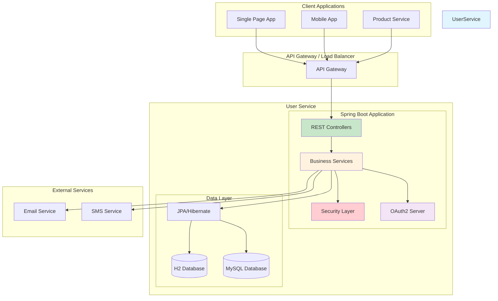
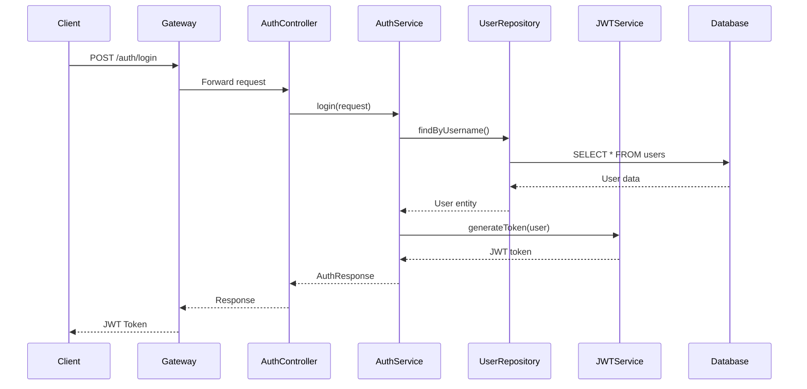
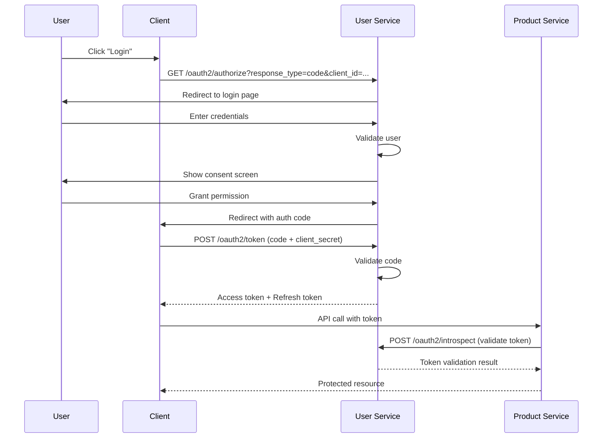
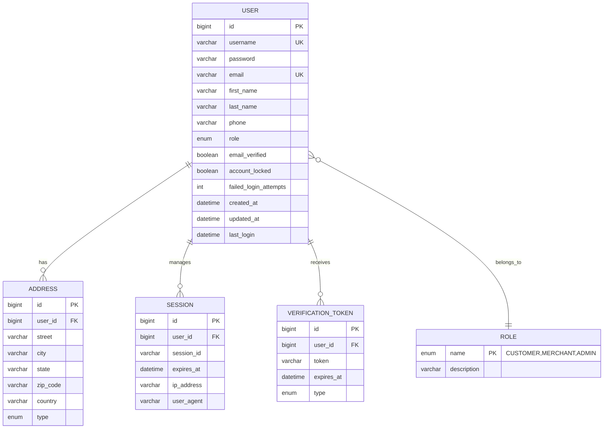
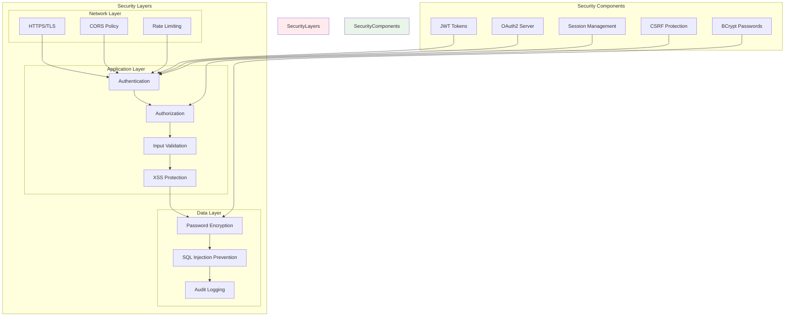
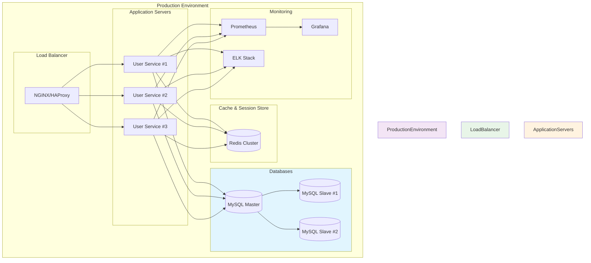
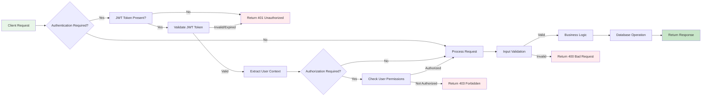
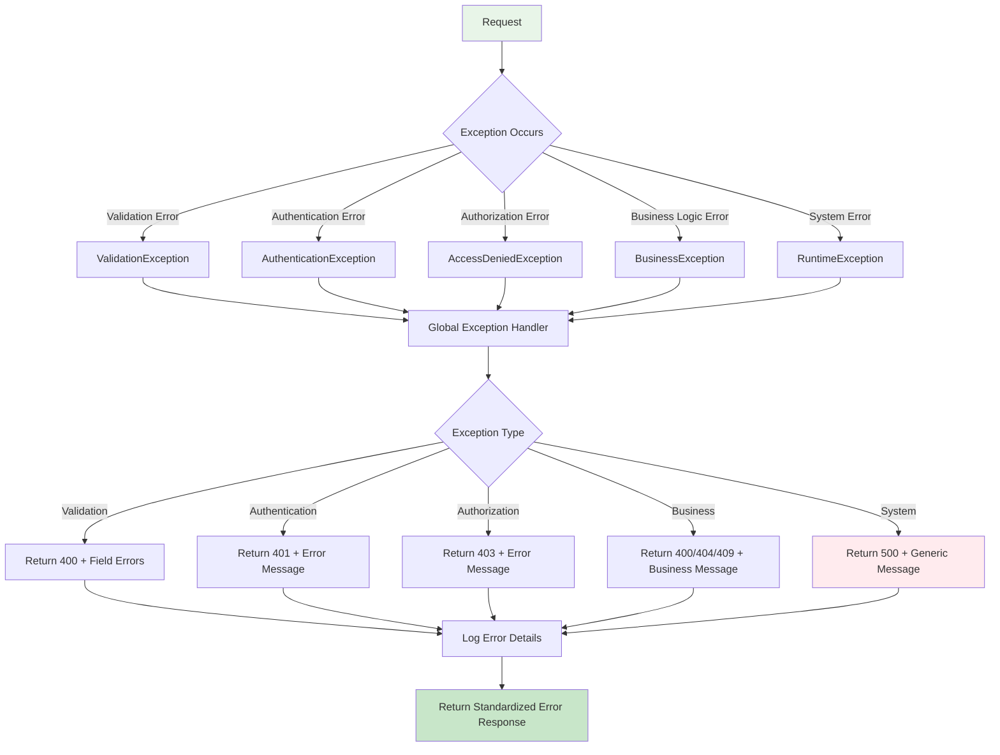

# User Service Architecture Diagrams 🏗️

## System Architecture Overview

## Component Interaction Flow

## OAuth2 Authorization Code Flow

## Database Schema Diagram

## Security Architecture

## Deployment Architecture

## API Request Flow

## Error Handling Flow

## Performance Monitoring

```mermaid
graph TB
    subgraph "Application Metrics"
        HTTP[HTTP Request/Response]
        DB[Database Queries]
        Cache[Cache Hit/Miss]
        Memory[JVM Memory Usage]
        CPU[CPU Usage]
        Threads[Thread Pool]
    end

    subgraph "Business Metrics"
        Auth[Authentication Success/Failure]
        UserReg[User Registrations]
        TokenGen[Token Generations]
        APIUsage[API Usage by Endpoint]
    end

    subgraph "Infrastructure Metrics"
        Disk[Disk I/O]
        Network[Network I/O]
        LoadAvg[System Load]
        Uptime[Service Uptime]
    end

    subgraph "Monitoring Stack"
        Prometheus[(Prometheus)]
        Grafana[Grafana Dashboard]
        AlertManager[Alert Manager]
        ELK[ELK Stack]
    end

    HTTP --> Prometheus
    DB --> Prometheus
    Cache --> Prometheus
    Memory --> Prometheus
    CPU --> Prometheus
    Threads --> Prometheus

    Auth --> Prometheus
    UserReg --> Prometheus
    TokenGen --> Prometheus
    APIUsage --> Prometheus

    Disk --> Prometheus
    Network --> Prometheus
    LoadAvg --> Prometheus
    Uptime --> Prometheus

    Prometheus --> Grafana
    Prometheus --> AlertManager
    Prometheus --> ELK

    style ApplicationMetrics fill:#e1f5fe
    style BusinessMetrics fill:#fff3e0
    style InfrastructureMetrics fill:#f3e5f5
    style MonitoringStack fill:#e8f5e8
```

## Development Workflow

```mermaid
graph LR
    A[Feature Request] --> B[Create Issue]
    B --> C[Design API]
    C --> D[Write Tests]
    D --> E[Implement Code]
    E --> F[Code Review]
    F --> G[Merge to Main]
    G --> H[Deploy to Staging]
    H --> I[Integration Tests]
    I --> J[Deploy to Production]
    J --> K[Monitor & Alert]

    style A fill:#e8f5e8
    style K fill:#c8e6c9
```

---

*These diagrams provide visual representations of the User Service architecture, flows, and processes. Use them as references for understanding the system design and implementation.*</content>
<parameter name="filePath">/Users/admin/IdeaProjects/ecommerce/user-service/ARCHITECTURE_DIAGRAMS.md
