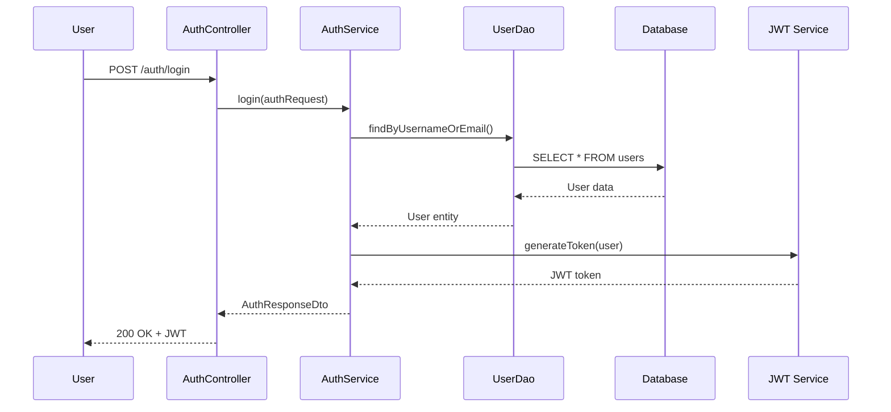
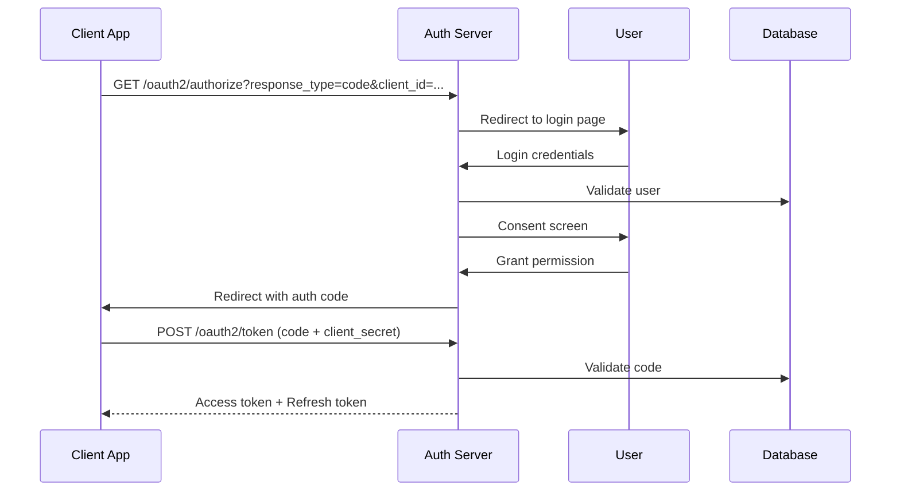
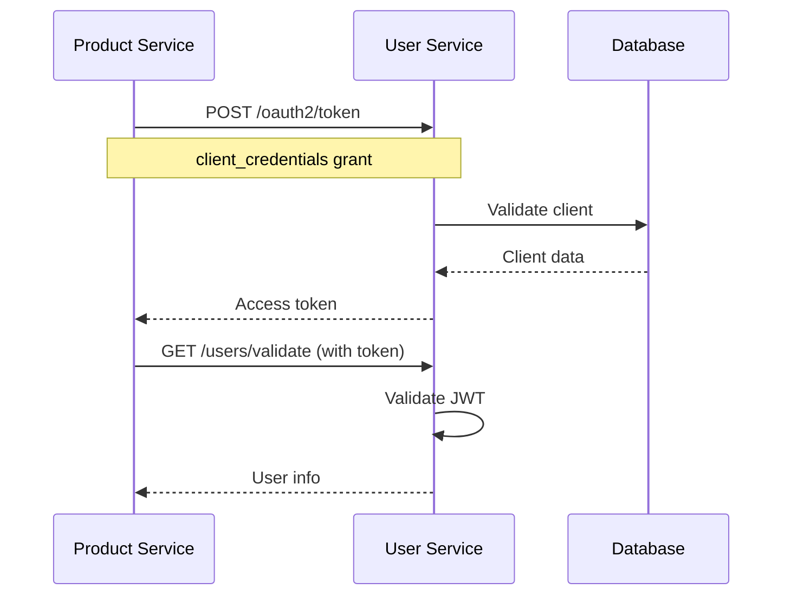
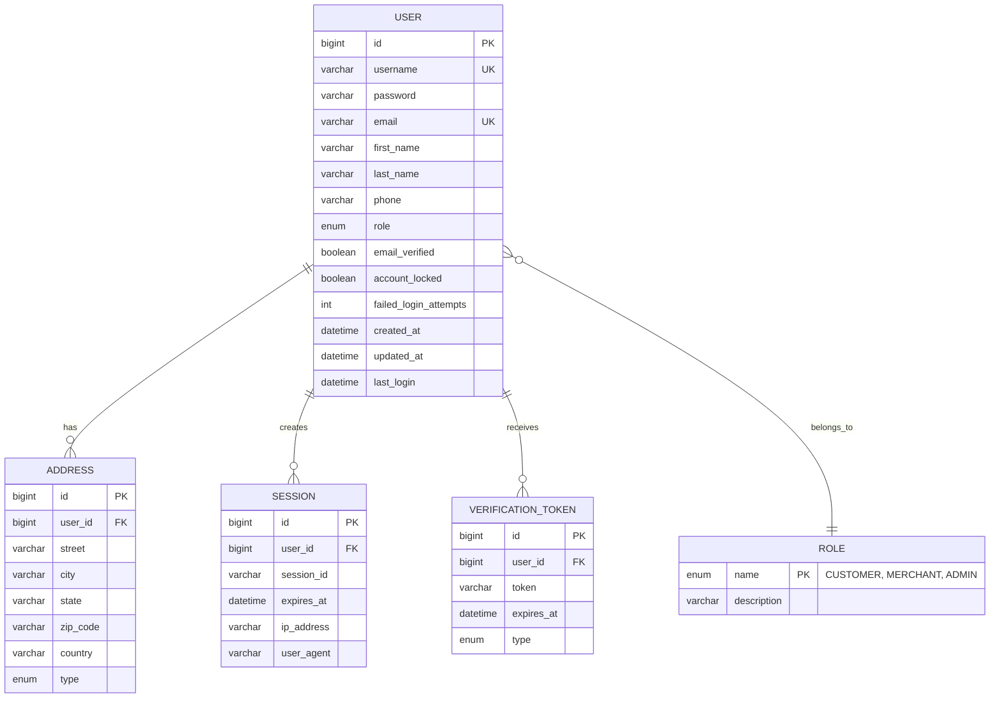

# User Service - Complete Developer Guide 🚀

## 🎯 Overview

The **User Service** is a comprehensive authentication and authorization microservice built with **Spring Boot 3.2.4** for an ecommerce platform. It provides secure user management, OAuth2/OIDC authentication, and service-to-service communication capabilities.


---

## 🏗️ System Architecture

### Core Components

```
┌─────────────────────────────────────────────────────────────┐
│                    User Service                             │
│  ┌─────────────────────────────────────────────────────┐    │
│  │               Controllers Layer                   │    │
│  │  ┌─────────┐ ┌─────────┐ ┌─────────┐ ┌─────────┐   │    │
│  │  │ Auth    │ │ User    │ │ Client  │ │ Admin   │   │    │
│  │  │Controller│ │Controller│ │Controller│ │Controller│   │    │
│  │  └─────────┘ └─────────┘ └─────────┘ └─────────┘   │    │
│  └─────────────────────────────────────────────────────┘    │
│                                                             │
│  ┌─────────────────────────────────────────────────────┐    │
│  │               Services Layer                      │    │
│  │  ┌─────────┐ ┌─────────┐ ┌─────────┐ ┌─────────┐   │    │
│  │  │ Auth    │ │ User    │ │ JWT     │ │ OAuth2  │   │    │
│  │  │ Service │ │ Service │ │ Service │ │ Service │   │    │
│  │  └─────────┘ └─────────┘ └─────────┘ └─────────┘   │    │
│  └─────────────────────────────────────────────────────┘    │
│                                                             │
│  ┌─────────────────────────────────────────────────────┐    │
│  │               Data Layer                          │    │
│  │  ┌─────────┐ ┌─────────┐ ┌─────────┐ ┌─────────┐   │    │
│  │  │ User    │ │ Address │ │ Session │ │ Token   │   │    │
│  │  │ Entity  │ │ Entity  │ │ Entity  │ │ Entity  │   │    │
│  │  └─────────┘ └─────────┘ └─────────┘ └─────────┘   │    │
│  └─────────────────────────────────────────────────────┘    │
└─────────────────────────────────────────────────────────────┘
```

### Technology Stack

| Component | Technology | Version |
|-----------|------------|---------|
| 🏗️ Framework | Spring Boot | 3.2.4 |
| 🔐 Security | Spring Security | 6.2.3 |
| 🔑 OAuth2 | Spring OAuth2 Auth Server | 1.2.3 |
| 🗄️ Database | H2/MySQL | Latest |
| 📊 ORM | Hibernate/JPA | 6.4.4 |
| 🔧 Build Tool | Maven | 3.x |
| ☕ Java | OpenJDK | 17 |

---

## 🔄 Authentication Flows

### 1. User Authentication Flow



### 2. OAuth2 Authorization Code Flow



### 3. Service-to-Service Flow



---

## 📊 Data Model

### User Entity Relationship



---

## 🔗 API Endpoints

### Authentication Endpoints

| Method | Endpoint | Description | Auth Required |
|--------|----------|-------------|---------------|
| `POST` | `/auth/login` | User login | ❌ No |
| `POST` | `/auth/signUp` | User registration | ❌ No |
| `POST` | `/auth/logout` | User logout | ✅ Yes |
| `GET` | `/auth/verify` | Email verification | ❌ No |
| `PUT` | `/auth/update/{userId}` | Update user profile | ✅ Yes |

### User Management Endpoints

| Method | Endpoint | Description | Auth Required |
|--------|----------|-------------|---------------|
| `GET` | `/users/profile` | Get user profile | ✅ Yes |
| `PUT` | `/users/profile` | Update user profile | ✅ Yes |
| `POST` | `/users/address` | Add user address | ✅ Yes |
| `GET` | `/users/addresses` | Get user addresses | ✅ Yes |
| `PUT` | `/users/address/{id}` | Update address | ✅ Yes |
| `DELETE` | `/users/address/{id}` | Delete address | ✅ Yes |

### OAuth2 Endpoints

| Method | Endpoint | Description | Auth Required |
|--------|----------|-------------|---------------|
| `GET` | `/.well-known/oauth-authorization-server` | Server metadata | ❌ No |
| `GET` | `/oauth2/authorize` | Authorization endpoint | ❌ No |
| `POST` | `/oauth2/token` | Token endpoint | ❌ No |
| `POST` | `/oauth2/introspect` | Token introspection | ✅ Client |
| `GET` | `/oauth2/jwks` | JWK Set | ❌ No |
| `POST` | `/oauth2/revoke` | Token revocation | ✅ Client |

### Client Management Endpoints

| Method | Endpoint | Description | Auth Required |
|--------|----------|-------------|---------------|
| `POST` | `/clients/register` | Register OAuth2 client | ✅ Admin |
| `GET` | `/clients/{clientId}` | Get client info | ✅ Admin |
| `GET` | `/clients` | List all clients | ✅ Admin |
| `DELETE` | `/clients/{clientId}` | Delete client | ✅ Admin |
| `POST` | `/clients/bootstrap/product-service` | Bootstrap product service client | ❌ No |

---

## 🔐 Security Configuration

### Spring Security Filter Chain

```java
@Configuration
@EnableWebSecurity
@EnableMethodSecurity(prePostEnabled = true)
public class SpringSecurityConfig {

    // 1. OAuth2 Authorization Server (Order 1)
    @Bean
    @Order(1)
    public SecurityFilterChain authorizationServerSecurityFilterChain(HttpSecurity http) {
        OAuth2AuthorizationServerConfiguration.applyDefaultSecurity(http);
        // OAuth2 endpoints: /oauth2/authorize, /oauth2/token, etc.
    }

    // 2. Application Security (Order 2)
    @Bean
    @Order(2)
    public SecurityFilterChain defaultSecurityFilterChain(HttpSecurity http) {
        http
            .authorizeHttpRequests(authz -> authz
                .requestMatchers("/auth/login", "/auth/signUp").permitAll()
                .requestMatchers("/h2-console/**").permitAll()
                .requestMatchers("/users/**").authenticated()
                .requestMatchers("/admin/**").hasRole("ADMIN")
                .anyRequest().authenticated()
            )
            .addFilterBefore(jwtAuthenticationFilter(), UsernamePasswordAuthenticationFilter.class);
    }
}
```

### JWT Token Structure

```json
{
  "alg": "RS256",
  "typ": "JWT"
}
{
  "iss": "http://localhost:8444",
  "sub": "user123",
  "aud": "product-service",
  "exp": 1693526400,
  "iat": 1693522800,
  "scope": "read write",
  "authorities": ["ROLE_CUSTOMER"],
  "client_id": "product-service"
}
```

---

## 🚀 Getting Started

### Prerequisites

- ☕ **Java 17** or higher
- 🏗️ **Maven 3.6+**
- 🗄️ **H2 Database** (included) or **MySQL**

### Quick Start

```bash
# 1. Clone the repository
git clone <repository-url>
cd user-service

# 2. Run with Maven
./mvnw spring-boot:run

# 3. Service will start on http://localhost:8444
```

### Configuration Profiles

```yaml
# application-local.properties (H2 Database)
spring:
  profiles:
    active: local
  datasource:
    url: jdbc:h2:file:./userdb
    driver-class-name: org.h2.Driver
  jpa:
    hibernate:
      ddl-auto: update

# application-dev.properties (MySQL Database)
spring:
  profiles:
    active: dev
  datasource:
    url: jdbc:mysql://localhost:3306/userdb
    username: your_username
    password: your_password
    driver-class-name: com.mysql.cj.jdbc.Driver
```

---

## 🧪 Testing the Service

### 1. Bootstrap Product Service Client

```bash
curl -X POST "http://localhost:8444/clients/bootstrap/product-service"
```

### 2. Get Access Token (Client Credentials)

```bash
curl -X POST http://localhost:8444/oauth2/token \
  -H "Content-Type: application/x-www-form-urlencoded" \
  -d "grant_type=client_credentials&scope=user.read" \
  --user "product-service:product-service-secret"
```

### 3. User Registration

```bash
curl -X POST "http://localhost:8444/auth/signUp" \
  -H "Content-Type: application/json" \
  -d '{
    "username": "johndoe",
    "email": "john@example.com",
    "password": "SecurePass123!",
    "firstName": "John",
    "lastName": "Doe"
  }'
```

### 4. User Login

```bash
curl -X POST "http://localhost:8444/auth/login" \
  -H "Content-Type: application/json" \
  -d '{
    "username": "johndoe",
    "password": "SecurePass123!"
  }'
```

### 5. Access Protected Resource

```bash
curl -X GET "http://localhost:8444/users/profile" \
  -H "Authorization: Bearer YOUR_JWT_TOKEN"
```

---

## 👤 User Registration & Login Guide

### Regular User Registration

#### Step 1: Register a New User

```bash
curl -X POST "http://localhost:8444/auth/signUp" \
  -H "Content-Type: application/json" \
  -d '{
    "username": "customer1",
    "email": "customer@example.com",
    "password": "Password@123",
    "firstName": "Jane",
    "lastName": "Smith"
  }'
```

**Expected Response:**
```json
{
  "token": "eyJhbGciOiJIUzI1NiJ9.eyJzdWIiOiJjdXN0b21lcjEi...",
  "expiresAt": "2024-12-24T10:30:00",
  "user": {
    "id": 1,
    "username": "customer1",
    "email": "customer@example.com",
    "firstName": "Jane",
    "lastName": "Smith",
    "role": "CUSTOMER",
    "emailVerified": false
  }
}
```

#### Step 2: Login with User Credentials

```bash
curl -X POST "http://localhost:8444/auth/login" \
  -H "Content-Type: application/json" \
  -d '{
    "username": "customer1",
    "password": "Password@123"
  }'
```

**Expected Response:**
```json
{
  "token": "eyJhbGciOiJIUzI1NiJ9.eyJzdWIiOiJjdXN0b21lcjEi...",
  "expiresAt": "2024-12-24T10:30:00",
  "user": {
    "id": 1,
    "username": "customer1",
    "email": "customer@example.com",
    "role": "CUSTOMER"
  }
}
```

#### Step 3: Access User Profile

```bash
# Save token from login response
TOKEN="eyJhbGciOiJIUzI1NiJ9.eyJzdWIiOiJjdXN0b21lcjEi..."

# Get user profile
curl -X GET "http://localhost:8444/users/profile" \
  -H "Authorization: Bearer $TOKEN"
```

#### Step 4: Update User Profile

```bash
curl -X PUT "http://localhost:8444/users/profile" \
  -H "Authorization: Bearer $TOKEN" \
  -H "Content-Type: application/json" \
  -d '{
    "firstName": "Jane",
    "lastName": "Smith-Johnson",
    "phone": "+1-555-0123"
  }'
```

#### Step 5: Add Address

```bash
curl -X POST "http://localhost:8444/users/address" \
  -H "Authorization: Bearer $TOKEN" \
  -H "Content-Type: application/json" \
  -d '{
    "street": "123 Main Street",
    "city": "New York",
    "state": "NY",
    "zipCode": "10001",
    "country": "USA",
    "type": "HOME"
  }'
```

---

## 👨‍💼 Admin Registration & Login Guide

### Option 1: Register Admin via Database

Admins cannot self-register through the API. Create admin users directly in the database:

```sql
-- Connect to your database
USE userdb;

-- Insert admin user
INSERT INTO users (
    username, 
    password, 
    email, 
    first_name, 
    last_name, 
    role, 
    email_verified, 
    account_locked,
    created_at
) VALUES (
    'admin',
    '$2a$10$xN3wV8Jb0eKQ0P4vKTqXxO7iRxEw0Z0fGMQY9r8v8/H2hJKq9nGzS', -- Password@123
    'admin@example.com',
    'Admin',
    'User',
    'ADMIN',
    true,
    false,
    NOW()
);
```

**Note:** The password hash above is for `Password@123`. In production, generate a new BCrypt hash:

```bash
# Using an online BCrypt generator or Java code
BCrypt.hashpw("YourSecurePassword", BCrypt.gensalt(10))
```

### Option 2: Use Bootstrap Script

Create a bootstrap script to initialize admin on first startup:

```bash
# Admin bootstrap (add to application startup)
curl -X POST "http://localhost:8444/auth/bootstrap/admin" \
  -H "Content-Type: application/json" \
  -d '{
    "username": "admin",
    "password": "Admin@2024!",
    "email": "admin@ecommerce.com",
    "firstName": "System",
    "lastName": "Administrator"
  }'
```

### Admin Login & Operations

#### Step 1: Login as Admin

```bash
curl -X POST "http://localhost:8444/auth/login" \
  -H "Content-Type: application/json" \
  -d '{
    "username": "admin",
    "password": "Password@123"
  }'
```

**Expected Response:**
```json
{
  "token": "eyJhbGciOiJIUzI1NiJ9.eyJzdWIiOiJhZG1pbiI...",
  "expiresAt": "2024-12-24T10:30:00",
  "user": {
    "id": 1,
    "username": "admin",
    "email": "admin@example.com",
    "role": "ADMIN"
  }
}
```

#### Step 2: View All Users (Admin Only)

```bash
# Save admin token
ADMIN_TOKEN="eyJhbGciOiJIUzI1NiJ9.eyJzdWIiOiJhZG1pbiI..."

# List all users
curl -X GET "http://localhost:8444/admin/users" \
  -H "Authorization: Bearer $ADMIN_TOKEN"
```

#### Step 3: Register OAuth2 Client (Admin Only)

```bash
curl -X POST "http://localhost:8444/clients/register" \
  -H "Authorization: Bearer $ADMIN_TOKEN" \
  -H "Content-Type: application/json" \
  -d '{
    "clientId": "mobile-app",
    "clientSecret": "mobile-secret-2024",
    "clientName": "Mobile Application",
    "redirectUris": ["https://mobile.app/callback"],
    "scopes": ["read", "write"],
    "authorizationGrantTypes": ["authorization_code", "refresh_token"]
  }'
```

#### Step 4: Delete User (Admin Only)

```bash
curl -X DELETE "http://localhost:8444/admin/users/123" \
  -H "Authorization: Bearer $ADMIN_TOKEN"
```

#### Step 5: Lock/Unlock User Account (Admin Only)

```bash
# Lock user account
curl -X PUT "http://localhost:8444/admin/users/123/lock" \
  -H "Authorization: Bearer $ADMIN_TOKEN"

# Unlock user account
curl -X PUT "http://localhost:8444/admin/users/123/unlock" \
  -H "Authorization: Bearer $ADMIN_TOKEN"
```

---

## 🔑 Role-Based Access Control (RBAC)

### Available Roles

| Role | Description | Permissions |
|------|-------------|-------------|
| **CUSTOMER** | Regular user | - View/edit own profile<br>- Manage own addresses<br>- Place orders |
| **MERCHANT** | Seller/vendor | - All CUSTOMER permissions<br>- Manage products<br>- View sales |
| **ADMIN** | System administrator | - All MERCHANT permissions<br>- Manage all users<br>- Manage OAuth2 clients<br>- System configuration |

### Protected Endpoints by Role

```java
// Public endpoints (no authentication required)
/auth/login
/auth/signUp
/.well-known/oauth-authorization-server

// Authenticated endpoints (any logged-in user)
/users/profile
/users/address/**

// Admin-only endpoints
/admin/**
/clients/** (except bootstrap)

// Merchant endpoints
/merchant/products/**
/merchant/orders/**
```

---

## 🔐 Password Requirements

Passwords must meet the following requirements:

- ✅ Minimum 8 characters
- ✅ At least one uppercase letter (A-Z)
- ✅ At least one lowercase letter (a-z)
- ✅ At least one digit (0-9)
- ✅ At least one special character (@$!%*?&)

**Valid password examples:**
- `Password@123`
- `SecurePass!2024`
- `MyP@ssw0rd`

**Invalid password examples:**
- `password` (no uppercase, digit, or special char)
- `Pass123` (no special character)
- `PASS@123` (no lowercase letter)

---

## 🔧 Development Workflow

### Project Structure

```
user-service/
├── src/main/java/com/user/service/
│   ├── UserServiceApplication.java          # Main application class
│   ├── conf/                                # Configuration classes
│   ├── controller/                          # REST controllers
│   │   ├── AuthController.java             # Authentication endpoints
│   │   ├── UserController.java             # User management
│   │   ├── ClientController.java           # OAuth2 client management
│   │   └── AdminController.java            # Admin operations
│   ├── dto/                                # Data Transfer Objects
│   │   ├── request/                        # Request DTOs
│   │   └── response/                       # Response DTOs
│   ├── entity/                             # JPA entities
│   │   ├── User.java                       # User entity
│   │   ├── Address.java                    # Address entity
│   │   ├── Session.java                    # Session entity
│   │   └── Token.java                      # Token entity
│   ├── repository/                         # JPA repositories
│   ├── security/                           # Security configuration
│   │   ├── SpringSecurityConfig.java       # Main security config
│   │   ├── jwt/                           # JWT utilities
│   │   └── models/                        # Security models
│   ├── services/                           # Business logic
│   ├── util/                               # Utility classes
│   ├── validation/                         # Validation logic
│   └── error/                              # Error handling
├── src/main/resources/
│   ├── application.properties              # Main configuration
│   ├── application-local.properties        # Local profile
│   ├── application-dev.properties          # Dev profile
│   ├── data.sql                           # Initial data
│   └── schema.sql                         # Database schema
└── src/test/                               # Test classes
```

### Key Classes Overview

#### Controllers

1. **AuthController** - Handles user authentication
   - `POST /auth/login` - User login
   - `POST /auth/signUp` - User registration
   - `POST /auth/logout` - User logout

2. **UserController** - User profile management
   - `GET /users/profile` - Get profile
   - `PUT /users/profile` - Update profile
   - `POST /users/address` - Add address

3. **ClientController** - OAuth2 client management
   - `POST /clients/register` - Register client
   - `GET /clients/{id}` - Get client info
   - `POST /clients/bootstrap/product-service` - Bootstrap client

#### Services

1. **AuthService** - Authentication business logic
2. **UserService** - User management operations
3. **JwtService** - JWT token operations

#### Entities

1. **User** - Main user entity with profile info
2. **Address** - User addresses
3. **Session** - User sessions
4. **Token** - Verification tokens

---

## 📈 Monitoring & Logging

### Health Check Endpoints

```bash
# Application health
curl http://localhost:8444/actuator/health

# Application info
curl http://localhost:8444/actuator/info

# Metrics
curl http://localhost:8444/actuator/metrics
```

### Logging Configuration

```properties
# application.properties
logging.level.org.springframework.security=DEBUG
logging.level.org.springframework.security.oauth2=DEBUG
logging.level.com.user.service=INFO

# File logging
logging.file.name=logs/user-service.log
logging.logback.rollingpolicy.max-file-size=10MB
```

---

## 🔍 Troubleshooting

### Common Issues

#### 1. Database Connection Issues

**Problem:** `Connection refused` or `Table not found`

**Solution:**
```bash
# Check H2 console
open http://localhost:8444/h2-console

# JDBC URL: jdbc:h2:file:./userdb
# Username: sa
# Password: (leave empty)
```

#### 2. OAuth2 Client Not Found

**Problem:** `Invalid client` error

**Solution:**
```bash
# Bootstrap the client
curl -X POST "http://localhost:8444/clients/bootstrap/product-service"

# Verify client exists
curl -X GET "http://localhost:8444/clients/product-service"
```

#### 3. JWT Token Issues

**Problem:** `Invalid token` or `Token expired`

**Solution:**
```bash
# Check token structure
curl -X POST "http://localhost:8444/oauth2/introspect" \
  -H "Content-Type: application/x-www-form-urlencoded" \
  -d "token=YOUR_TOKEN" \
  --user "product-service:product-service-secret"
```

---

## 📚 API Documentation

### Swagger UI

Access the interactive API documentation at:
```
http://localhost:8444/swagger-ui.html
```

### OpenAPI Specification

The service provides comprehensive OpenAPI 3.0 documentation with:
- Detailed endpoint descriptions
- Request/response schemas
- Authentication requirements
- Example requests

---

## 🎯 Best Practices

### Security Best Practices

1. **Password Policies**
   - Minimum 8 characters
   - Mix of uppercase, lowercase, numbers, symbols
   - No common passwords

2. **Token Management**
   - Short-lived access tokens (1 hour)
   - Secure refresh token storage
   - Regular token rotation

3. **Input Validation**
   - Server-side validation on all inputs
   - Sanitize user inputs
   - Use parameterized queries

### Performance Best Practices

1. **Database Optimization**
   - Use appropriate indexes
   - Connection pooling
   - Query optimization

2. **Caching Strategy**
   - Cache user sessions
   - Cache OAuth2 tokens
   - Cache frequently accessed data

3. **Monitoring**
   - Application metrics
   - Database performance
   - Security events logging

---

## 🚀 Deployment

### Docker Deployment

```dockerfile
FROM openjdk:17-jdk-slim
COPY target/user-service-0.0.1-SNAPSHOT.jar app.jar
EXPOSE 8444
ENTRYPOINT ["java","-jar","/app.jar"]
```

### Kubernetes Deployment

```yaml
apiVersion: apps/v1
kind: Deployment
metadata:
  name: user-service
spec:
  replicas: 3
  selector:
    matchLabels:
      app: user-service
  template:
    metadata:
      labels:
        app: user-service
    spec:
      containers:
      - name: user-service
        image: user-service:latest
        ports:
        - containerPort: 8444
        env:
        - name: SPRING_PROFILES_ACTIVE
          value: "prod"
```

---

## 📞 Support & Resources

### Useful Links

- [Spring Boot Documentation](https://spring.io/projects/spring-boot)
- [Spring Security OAuth2](https://docs.spring.io/spring-security/reference/servlet/oauth2/index.html)
- [JWT.io](https://jwt.io/) - JWT debugger
- [OAuth2 Specification](https://tools.ietf.org/html/rfc6749)

### Getting Help

1. **Check the logs** - Enable debug logging for troubleshooting
2. **Use H2 Console** - Inspect database state
3. **Test endpoints** - Use the provided curl commands
4. **Review configuration** - Check application properties

---

## 🎉 Success Metrics

✅ **Completed Features:**
- OAuth2 Authorization Server with JWT
- User registration and authentication
- Role-based access control (RBAC)
- Comprehensive input validation
- Session management
- Address management
- Client management
- Service-to-service authentication

🚧 **Next Steps:**
- API documentation completion
- Advanced user features
- Integration testing
- Performance optimization

---

*This documentation provides a comprehensive guide for developers to understand, develop, and maintain the User Service. For any questions or contributions, please refer to the project repository.*</content>
<parameter name="filePath">/Users/admin/IdeaProjects/ecommerce/user-service/README.md
